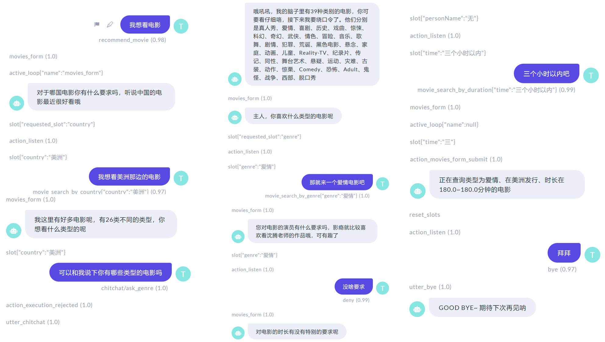

# 说明

该项目基于`rasa`进行开发，我们标注了`28`个意图，总共含有`522`个句子，`7`个实体，部分标注如下图所示。采用`jieba`分词器，`Bert`预训练模型，实体识别和意图识别采用`DIET`(`rasa`官方推荐)，具体的`Pipline`可以参考`config.yml`。


使用方法如下：

1. 首先输入

   ```shell
   rasa run actions
   ```

   来启动服务

2. 然后输入

   ```shell
   rasa x
   ```

   打开对应的网址进行测试


部分测试图如下所示。

下图为闲聊案例。


下图为任务型驱动对话案例（下面的”三个小时以内吧“解析成了”180~180分钟的电影“，问题出现在`action.py`文件中，该部分的解析需要手动进行，我设定了一些规则，但是没有覆盖全部）。

